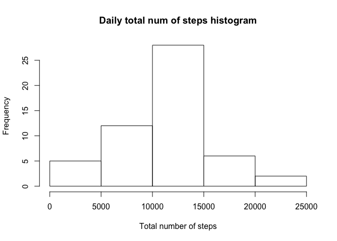
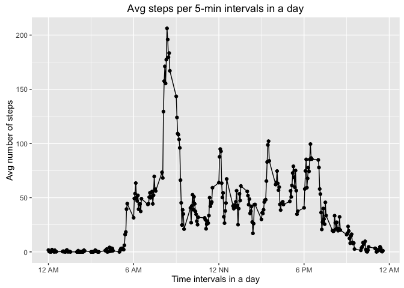
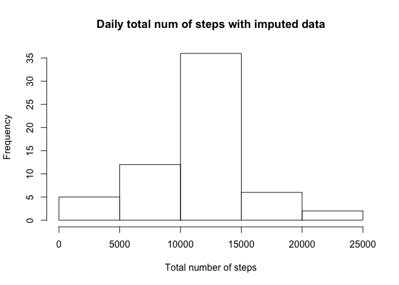
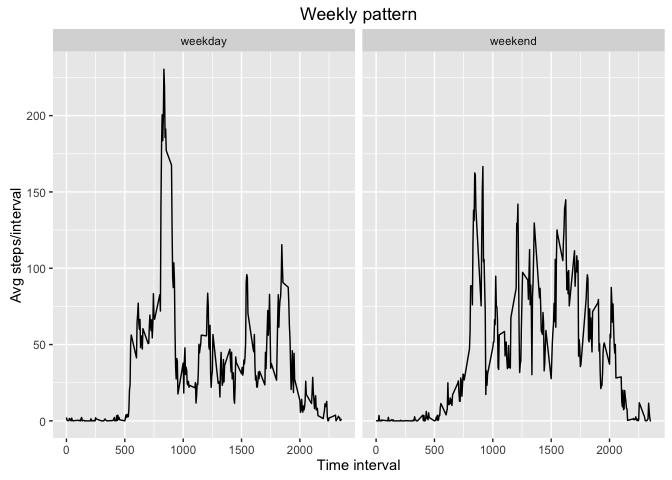

# Reproducible Research: Peer Assessment 1
  
#Introduction 
This markdown file contains code and logic for the assignment for Reproducible Research week 2 project. The execution needs the input file activity.csv in the current directory. All the KnitR execution outputs are stored within the document and/or within the current directory and subdirectories.


## Loading and preprocessing the data
We need to read the data from file activity.csv. 

```r
actdata <- read.csv("activity.csv",header=TRUE)
```
##setting the libraries
We need the libraries ggplot2 and dplyr for this project.

```r
library(ggplot2)
library(scales)
library(dplyr)
```

```
## 
## Attaching package: 'dplyr'
```

```
## The following objects are masked from 'package:stats':
## 
##     filter, lag
```

```
## The following objects are masked from 'package:base':
## 
##     intersect, setdiff, setequal, union
```
## What is mean total number of steps taken per day?
To calculate the mean total number of steps per day, first we need to calculate the total number of steps for each specific date given. The mean of these totals will be the mean total number of steps per day. We can get both this mean and the median from the summary of the tapply results. 

```r
daydata <- tapply(actdata$steps,actdata$date,FUN=sum)
summary(daydata)
```

```
##    Min. 1st Qu.  Median    Mean 3rd Qu.    Max.    NA's 
##      41    8841   10760   10770   13290   21190       8
```
Median number for total number of steps/day = 10760.  
Mean for total number of steps/day = 10770.  
Histogram of the total number of steps taken each day is shown:

```r
hist(daydata,main="Daily total num of steps histogram", xlab="Total number of steps")
```

<!-- -->
    
## What is the average daily activity pattern?
The information received is recorded as number of steps per 5-minute intervals spread over a day for specific dates. 
The daily activity pattern is plotted using a graph with time on the x axis, with each point representing a 5-minute interval indicated by time, starting from 0 at 12 AM and incremented by 5 until we reach the 60 min mark, when the counter is incremented by 100 (to denote the next  hour). This pattern continues till the last recording at 2355. 
To get the aerage daily activity pattern, first we need to calculate the mean number of steps corresponding to each interval, over all the dates available.

```r
meansteps <- tapply(actdata$steps,actdata$interval,FUN=mean,na.rm=TRUE)
intmeandf <- NULL
intmeandf <- data.frame(key=names(meansteps),value=meansteps)
# convert factor to character
intmeandf$key <- as.character(intmeandf$key)
```
The intmeandf dataframe contains the mean of steps per specific interval, over all the dates.  
Next we need to format the time for better clarity.  

```r
for (i in 1:nrow(intmeandf)) {
 # print(i)
  if (nchar(intmeandf$key[i]) == 1) {
    intmeandf$key[i] <- paste0('000',intmeandf$key[i]) 
  }
  else if (nchar(intmeandf$key[i]) == 2) {
    intmeandf$key[i] <- paste0('00',intmeandf$key[i]) 
  }
  else if (nchar(intmeandf$key[i]) == 3) {
    intmeandf$key[i] <- paste0('0',intmeandf$key[i]) 
  }
}
intmeandf$timeint <- as.POSIXct(intmeandf$key,format="%H%M") 
intmeandf$tim <- substr(intmeandf$timeint,12,16)
intmeandf$tim <- gsub(":",".",intmeandf$tim)
intmeandf$tim <- as.numeric(intmeandf$tim)
```
Plot the time vs daily avg steps/interval pattern.

```r
disp<- ggplot(intmeandf,aes(intmeandf$tim,intmeandf$value)) + geom_point() + geom_line()
disp <- disp + labs(title="Avg steps per 5-min intervals in a day", x="Time intervals in a day",y="Avg number of steps")
disp <- disp + scale_x_continuous(breaks=c(0,6,12,18,24),labels=c("12 AM","6 AM","12 NN","6 PM","12 AM"))
disp
```

<!-- -->
  
From this plot, we see that the maximum average number of steps is about halfway in the region between 8 and 9 am. We can calculate it as:

```r
# the interval with max avg number of steps
maxstepint <- intmeandf$tim[intmeandf$value==max(intmeandf$value)]
print(c("The avg max number of steps occurs at: " ,maxstepint))
```

```
## [1] "The avg max number of steps occurs at: "
## [2] "8.35"
```
From this we see that the interval with max number of steps on avg is 8:35 am.     

## Imputing missing values   
In the original dataset, we find a lot of rows with missing values for the variable 'steps'. 

```r
nmissing <- sum(is.na(actdata))
print(c("The number of rows with missing step information is :",nmissing))
```

```
## [1] "The number of rows with missing step information is :"
## [2] "2304"
```
We can susbstitute  the missing step info for the specific interval with the overall daily average steps/interval value that we calculated earlier.  

```r
# rename columns for clarity
names(intmeandf)[names(intmeandf)=="key"] <- "Interval"
names(intmeandf)[names(intmeandf)=="value"] <- "AvgStepNum"
# create new dataset, fill in missing values
actdata2 <- actdata
for (i in 1:nrow(actdata2)) {
  if (is.na(actdata2$steps[i])){
    actdata2$steps[i] <- intmeandf$AvgStepNum[as.numeric(intmeandf$Interval)==actdata2$interval[i]]
  }
}
missingrows <- sum(is.na(actdata2))
print(c("We have reduced number of missing rows to ",missingrows))
```

```
## [1] "We have reduced number of missing rows to "
## [2] "0"
```
We can calculate the daily totals  with the imputed data. As we can see, the median remains the same and the mean is only slightly different from original data. 

```r
daydata2 <- tapply(actdata2$steps,actdata2$date,FUN=sum)
summary(daydata2)
```

```
##    Min. 1st Qu.  Median    Mean 3rd Qu.    Max. 
##      41    9819   10770   10770   12810   21190
```

```r
hist(daydata2,main="Daily total num of steps with imputed data", xlab="Total number of steps")
```

<!-- -->
  
Median number for total number of steps/day with imputed data = 10770.  
Mean for total number of steps/day with imputed data= 10770.    

## Are there differences in activity patterns between weekdays and weekends?
Our next step is to explore any differences in number of steps between weekdays and weekends. For this, first we need to identify whether each date is a weekday vs weekend. We use the 'weekdays' function for this.

```r
actdata2$wkdayfactor <- NULL
actdata2$date <- as.character(actdata2$date)
for (i in 1:nrow(actdata2)) {
  if (weekdays(as.Date(actdata2$date[i])) %in% c("Monday","Tuesday","Wednesday","Thursday","Friday")){
    actdata2$wkdayfactor[i] <- "weekday"  
  }
  else
    actdata2$wkdayfactor[i] <- "weekend"
}
actdata2$wkdayfactor <- as.factor(actdata2$wkdayfactor)
```
Our next step is to sum up the steps information for the intervals based on the category weekday/weekend. We calculate the mean of the steps for each interval over all the dates given, within each category. Then we plot this data together so we can compare the activity between weekdays and weekends.

```r
wkdata <- with(actdata2, aggregate(steps,list(interval,wkdayfactor),FUN=mean))
# rename results for clarity
names(wkdata) <- c("Interval","Wkday","AvgSteps")
wkdata$AvgSteps <- as.character(wkdata$AvgSteps)
wkdata$AvgSteps <- as.numeric(wkdata$AvgSteps)
par(mfrow=c(2,2))
plot1 <-  with(wkdata,qplot(Interval,AvgSteps,facets=.~Wkday,geom="line"))
plot1 <- plot1 + labs(title="Weekly pattern") +xlab("Time interval") +ylab("Avg steps/interval")
plot1
```

<!-- -->
  
As we can see, the steps activity over the weekend period is considerably lesser than the weekday period.  
